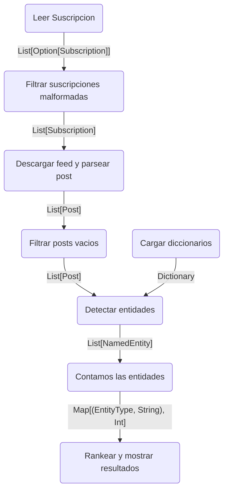

```mermaid
flowchart TB

A(Leer Suscripcion) 
B(Filtrar suscripciones malformadas)
C(Descargar feed y parsear post)
D(Filtrar posts vacios)
E(Detectar entidades)
F(Contamos las entidades)
G(Rankear y mostrar resultados)
H(Cargar diccionarios)

A --> |"List[Option[Subscription]]"| B
B --> |"List[Subscription]"| C
C-->|"List[Post]"|D
D-->|"List[Post]"|E
E-->|"List[NamedEntity]"|F
H-->|"Dictionary"|E
F-->|"Map[(EntityType, String), Int]"|G
```