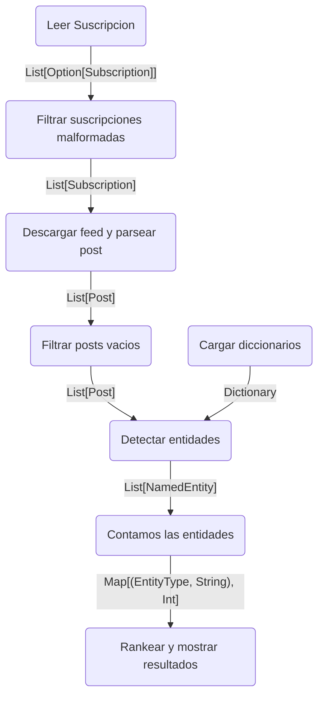

## Ejercicio 1A
Diagrama de flujo

## Ejercicio 1B
Pasos del pipeline que pueden ser expresados con las abstracciones de Spark:
A-->B No hay abstraccion, leer las subs lo hace el driver 
B-->C Se utiliza filter y con esto elimino las listas malformadas None, queda asi List(sub1, sub2, sub3).
C-->D Para esto usamos flatMap.
D-->E Se usa filter para filtrar los posts vacios.
E-->F Detectar entidades se puede escribir con flatMap porque por cada post se pueden detectar varias entidades.
F-->G para contar entidades podemos usar reduceByKey porque lo que haria es hagarrar todos los elementos que tengan el mismo nombre y devovleria la cantidad.
Para rankear y mostrar resultados no hay ninguna abstraccion porque los drivers se encargan de eso. Lo mismo con la carga de diccionarios. 

## Ejecicio 1C
Pasos del pipeline son barreras y no pueden ejecutarse de forma independiente:
Contar entidades (reduceByKey) es una barrera de sincronización porque para saber cuántas veces aparece cada entidad necesitás que todos los workers hayan terminado de detectar entidades. Ningún worker puede dar el conteo final hasta que todos hayan procesado sus posts.
Pasos del pipeline que pueden ejecutarse de forma completamente independiente entre workers:
Todos excepto contar entidades porque dependemos de que tengamos la lista completa de entidades.

## Ejercicio 1D 
Las funciones que se le pasan a Spark deben poder serializarse para viajar por la red a los workers. No pueden depender de estado compartido porque cada worker trabaja de forma independiente. Y deben evitar efectos secundarios porque Spark puede reejecutar una función si un worker falla.