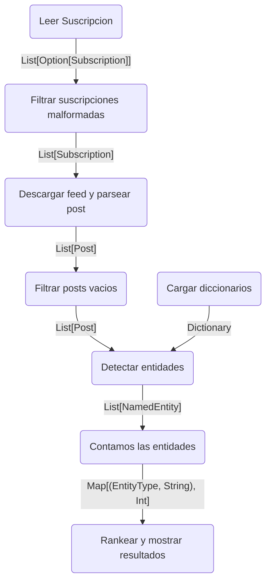

## Ejercicio 1A
Diagrama de flujo

## Ejercicio 1B
Pasos del pipeline que pueden ser expresados con las abstracciones de Spark:
A-->B No hay abstraccion, leer las subs lo hace el driver 
B-->C Se utiliza filter y con esto elimino las listas malformadas None, queda asi List(sub1, sub2, sub3).
C-->D Para esto usamos flatMap.
D-->E Se usa filter para filtrar los posts vacios.
E-->F Detectar entidades se puede escribir con flatMap porque por cada post se pueden detectar varias entidades.
F-->G para contar entidades podemos usar reduceByKey porque lo que haria es hagarrar todos los elementos que tengan el mismo nombre y devovleria la cantidad.
Para rankear y mostrar resultados no hay ninguna abstraccion porque los drivers se encargan de eso. Lo mismo con la carga de diccionarios. 

## Ejecicio 1C
Pasos del pipeline son barreras y no pueden ejecutarse de forma independiente:
Contar entidades (reduceByKey) es una barrera de sincronización porque para saber cuántas veces aparece cada entidad necesitás que todos los workers hayan terminado de detectar entidades. Ningún worker puede dar el conteo final hasta que todos hayan procesado sus posts.
Pasos del pipeline que pueden ejecutarse de forma completamente independiente entre workers:
Todos excepto contar entidades porque dependemos de que tengamos la lista completa de entidades.

## Ejercicio 1D 
Las funciones que se le pasan a Spark deben poder serializarse para viajar por la red a los workers. No pueden depender de estado compartido porque cada worker trabaja de forma independiente. Y deben evitar efectos secundarios porque Spark puede reejecutar una función si un worker falla.

## Ejercicio 2 
En caso de propagarse las excepciones dentro de un worker, el driver fallaria e intentaria relanzar la tarea hasta un maximo de *spark.task.maxFailures* , si todos los intentos de llevar a cabo la tarea fallaran el sistema colapsaria, por eso cada worker debe tener un manejar las excepciones que se podrian presentar de manera independiente.

## Ejercicio 3
reduceByKey es una barrera de sincronización porque ningún worker puede calcular el total final de entidades hasta que todos los workers terminen de trabajar y envien sus datos, sino los datos estarian incompletos.
La restricción que tiene la función que se le pasa a reduceByKey es que trabaja sumando 2 valores, al ser asociativa y conmutativa puede sumar los resultados de distintos workers sin importar el orden.
La lectura del diccionario se hace en el driver asi Spark lo serializa y se lo envia a los workers.

## Ejercicio 4
a) Porque los workers solo tienen permisos de escritura (.add) y no pueden leer el valor consolidado del acumulador durante la ejecución distribuida. Intentar usar su valor para alterar el flujo lógico haría que cada worker tome decisiones a ciegas basándose solo en su fragmento de datos, rompiendo la consistencia del pipeline.
Un Accumulator puede dar un valor incorrecto si estos se modifican dentro de transformaciones como map o flatMap y una tarea distribuida falla. Si Spark reinicia una tarea fallida para garantizar la tolerancia a fallos, volverá a ejecutar el código de la transformación y se contaria dos veces el acumulador.

b) Está disponible inmediatamente después de que se complete la ejecución de una acción terminal (.collect()). En ese momento, Spark consolida los resultados de todos los workers y le permite al Driver leer el total definitivo mediante el método .value.

c) En cuanto al tiempo de ejecución, a pesar de trabajar con un volumen acotado de datos (4 feeds y 100 posts),ejecutando las dos versiones en la mismas condicioenes (en este caso usando mock) se consiguió un tiempo de 12 segundos con Apache Spark y en la implementación secuencial de base 22 segundos. Es importante aclarar que estos datos cambian entre computadora y computadora dado a que la velocidad de Spark está ligada a la cantidad de nucleos del procesador pero de igual manera. Mientras que la versión secuencial realiza las peticiones HTTP al servidor mock una por una de manera lineal, sufriendo acumulativamente las latencias de red, Spark distribuye las suscripciones en un RDD aprovechando el multi-threading local. Esto permite que las descargas de internet ocurran en forma simultánea y concurrente en los Workers, absorbiendo los tiempos de espera muertos y superando con creces el costo del overhead de inicialización del entorno distribuido.

## Ejercicio 5 

1) Con nuestra version original la descarga de archivos se ejecutaba dos veces, una al llamar a collect para utilizar el codigo base de avgChars y otra luego de llamar nuevamente a collect en el calculo de entidades al haber recontruido el rdd para el punto 3 , al aplicar el cache logramos que la descarga se aplique una sola vez.

2) Se rompe la distribución, el driver se convierte en cuello de botella. Si tenemos millones de posts, el driver tiene que cargar todo en memoria y se duplica el tráfico de red — los datos viajan workers→driver y después driver→workers sin ningún beneficio.

3) El rdd se guarda en la memoria de los workers recién cuando se ejecuta la primera acción terminal sobre ese RDD (en nuestro version final, cuando llamamos a .count()).